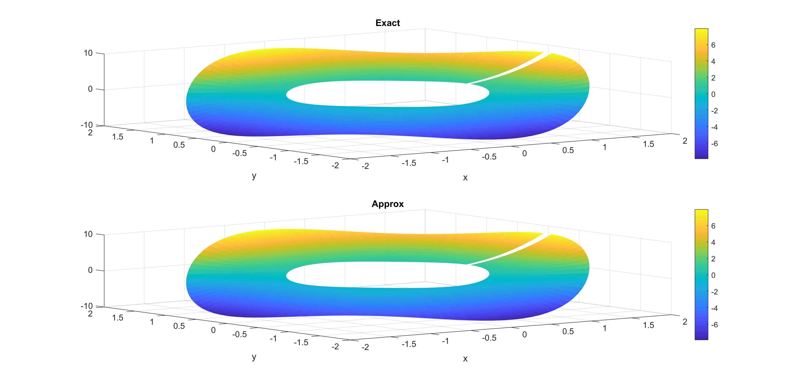
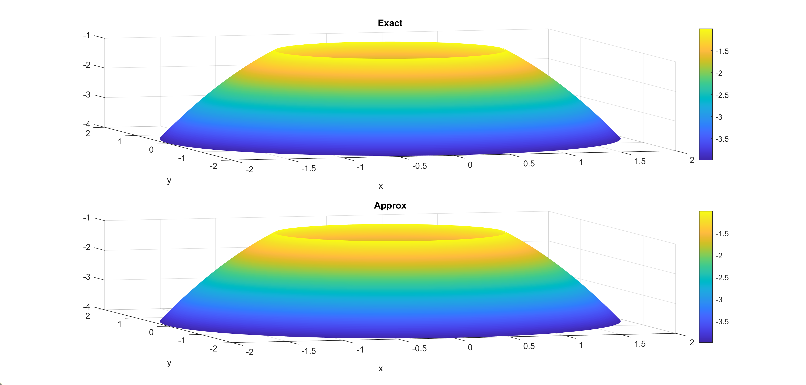
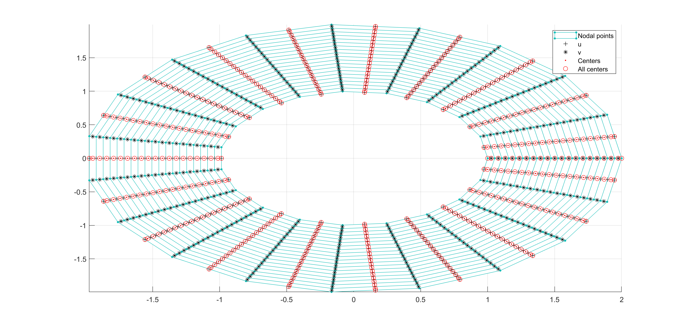
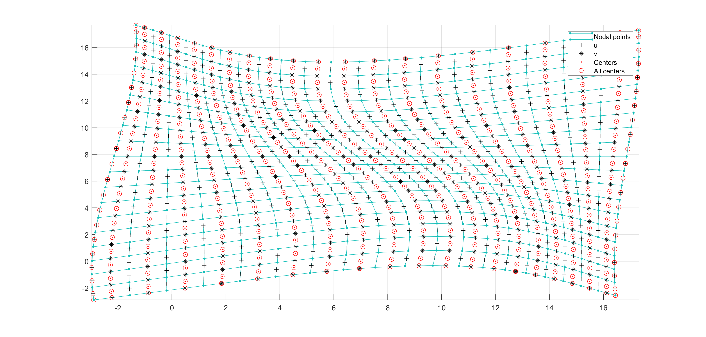
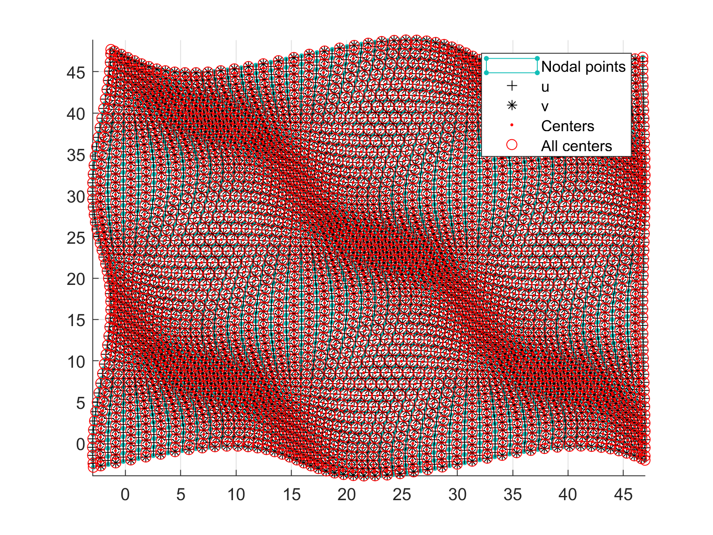
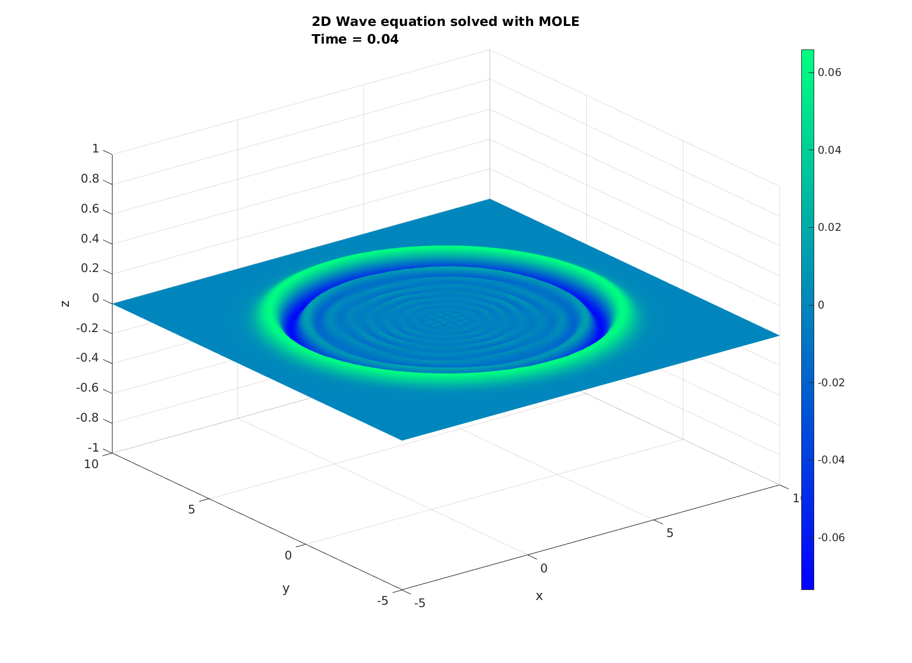

MOLE: Mimetic Operators Library Enhanced
========================================

1: Description
--------------

MOLE is a high-quality (C++ & MATLAB/Octave) library that implements 
high-order mimetic operators to solve partial differential equations. 
It provides discrete analogs of the most common vector calculus operators: 
Gradient, Divergence, Laplacian, Bilaplacian, and Curl. These operators (highly sparse matrices) act 
on staggered grids (uniform, non-uniform, curvilinear) and satisfy local and 
global conservation laws.

Mathematics is based on the work of [Corbino and Castillo, 2020](https://doi.org/10.1016/j.cam.2019.06.042). 
However, the user may find helpful previous publications, such as [Castillo and Grone, 2003](https://doi.org/10.1137/S0895479801398025),
in which similar operators were derived using a matrix analysis approach.

2: Licensing
------------

MOLE is distributed under a GNU General Public License; please refer to the _LICENSE_ 
file for more details.

3: Installation (Linux)
-----------------------

To use MOLE (C++ version), you need to have _Armadillo C++_ <http://arma.sourceforge.net>, _SuperLU_ 
<https://portal.nersc.gov/project/sparse/superlu>, and _OpenBLAS_ <https://www.openblas.net> installed on your computer.

Assuming a working installation of _SuperLU_ (`sudo apt install libsuperlu-dev` or `sudo yum install SuperLU-devel`), and _OpenBLAS_ (`sudo apt install libopenblas-dev` or `sudo yum install openblas-devel`), follow these steps:

`wget https://sourceforge.net/projects/arma/files/armadillo-12.6.6.tar.xz`

`tar xvf armadillo-12.6.6.tar.xz`

`cd armadillo-12.6.6`

**NOTE:** We suggest to use the latest stable version.

Define `ARMA_USE_SUPERLU` and `ARMA_USE_OPENMP` in `include/armadillo_bits/config.hpp`. Make sure that you have `cmake` and `g++` installed before executing:

`./configure`

`make`

This will create `libarmadillo.so`.

Now go to `mole/` and build MOLE via:

`ARMA=PATH_TO_ARMADILLO_FOLDER make`

Or simply:

`make`

if _Armadillo_ was installed via `sudo apt install libarmadillo-dev` or `sudo yum install armadillo-devel`.

A static library named `libmole.a` will be created after the previous step. From this point, you need to include `mole.h` 
in your projects, specify the location of `libmole.a` to the linker. For the users interested in building MOLE as a _shared library_, specify `make SHARED_LIB=1`. Make sure to include `mole_C++` directory in `LD_LIBRARY_PATH` (`export LD_LIBRARY_PATH=/full/path/to/mole_C++`) so the loader can find the library at runtime.

**For our library's MATLAB/Octave version, the only dependency is to have MATLAB/Octave installed**.
The two implementations of MOLE (C++ & MATLAB/Octave) are independent; you don't need
to build the C++ version if you are just interested in using MOLE from MATLAB/Octave.

3.1: Installation (Mac)
-----------------------

To use MOLE (C++ version), you need to have _Armadillo C++_ <http://arma.sourceforge.net>, _SuperLU_ 
<https://portal.nersc.gov/project/sparse/superlu>, and _OpenBLAS_ <https://www.openblas.net> installed on your computer.

On Macs, you can install superlu using the following steps:
a. Open a terminal
b. (type) brew install superlu 
Note (assuming that it is installing ver 7.0.0): This will install superlu in a directory called /opt/homebrew/Cellar/superlu/7.0.0/lib

On Macs, you can install openblas using the following steps:
a. Open a terminal
b. (type) brew install openblas 
Note: This will install openblas in the directory called /opt/homebrew/opt/openblas/lib

On Mac, we will need to change the makefiles to now point to the right paths. We need to make the following changes:

1. open the Makefile in mole/src/tests directory
2. Add the following extra path namely -L/opt/homebrew/Cellar/superlu/7.0.0/lib (as shown below)
ifdef SUPERLU
LIBS += -L$(SUPERLU)/lib -Wl,-rpath,$(SUPERLU)/lib -lsuperlu -L/opt/homebrew/Cellar/superlu/7.0.0/lib
else
LIBS += -lsuperlu -L/opt/homebrew/Cellar/superlu/7.0.0/lib
endif
3. Add the path to openblas namely -L/opt/homebrew/opt/openblas/lib  as shown below
LIBS = -L$(MOLE) -lmole -lopenblas -L/opt/homebrew/opt/openblas/lib

As mentioned in the Linux instllation above, do the following steps as usual - 
Define `ARMA_USE_SUPERLU` and `ARMA_USE_OPENMP` in `include/armadillo_bits/config.hpp`. 

Another quriky change is the usage of makefiles on mac. Depending on the version of the software packages installed on your mac,
you may encounter difficulties in compiling. Follow the instructions given in section 3.0 above. If you are unable to compile, use the following command 

To compile the source code in mole/src/mole_C++/
- make CXX=g++-14 CC=gcc-14
To compile the source code in mole/src/examples/examples_C++/
- make CXX=g++-14 CC=gcc-14

4: Running Examples & Tests
---------------------------

Here are instructions on how to run the provided examples and tests for both the C++ and MATLAB versions of the library to help you quickly get started with MOLE.

* **tests/cpp:**
These tests, which are automatically executed upon constructing the library's C++ version, play a crucial role in verifying the correct installation of MOLE and its dependencies. There are four tests in total.

* **tests/matlab:**
We encourage MATLAB users to execute these tests before using MOLE by entering the `tests/matlab` directory and executing `run_tests.m` from MATLAB. These tests are analogous to those contained in `tests/cpp`.

* **examples/cpp:**
These will be automatically built after calling `make`. We encourage C++ users to make this their entry point to familiarize themselves with this library version. The four examples are self-contained and adequately documented, and they solve typical PDEs.

* **examples/matlab:**
Most of our examples are provided in the MATLAB scripting language. Over 30 examples range from linear one-dimensional PDEs to highly nonlinear multidimensional PDEs.

5: Documentation
----------------

The folder `doc/api_docs/matlab` contains generated documentation about the MATLAB/Octave API.
It was generated with a tool called [_m2html_](https://www.gllmflndn.com/software/matlab/m2html). However, for a quick start on MOLE's MATLAB/Octave version, we recommend starting with this short [guide](https://github.com/csrc-sdsu/mole/blob/master/doc/assets/manuals/CSRC%20Report%20on%20MOLE.pdf).

For C++ users, we provide a short [guide](https://github.com/csrc-sdsu/mole/blob/master/doc/assets/manuals/MOLE_C%2B%2B_Quick_Guide.pdf) to MOLE's C++ flavor. However, for those in need of more details to interact with the library, we suggest to follow these instructions:

To generate the C++ documentation, execute:

`doxygen Doxyfile` (requires _Doxygen_ and _Graphviz_)

this will create a folder called `doc_C++` containing a set of _html_ files. Please take a look at the _index.html_ file 
to start browsing the documentation.

**NOTE:**
Performing non-unary operations involving operands constructed over different grids may lead to unexpected results. While MOLE allows such operations without throwing errors, users must exercise caution when manipulating operators across different grids.

6: Community Guidelines
-----------------------

We welcome contributions to MOLE, whether they involve adding new functionalities, providing examples, addressing existing issues, reporting bugs, or requesting new features. Please refer to our [Contribution Guidelines](https://github.com/csrc-sdsu/mole/blob/master/CONTRIBUTING.md) for more details.

7: Citations
------------

Please cite our work if you use MOLE in your research or software. 
Citations are helpful for the continued development and maintenance of 
the library 

Now, some cool pictures obtained with MOLE:

